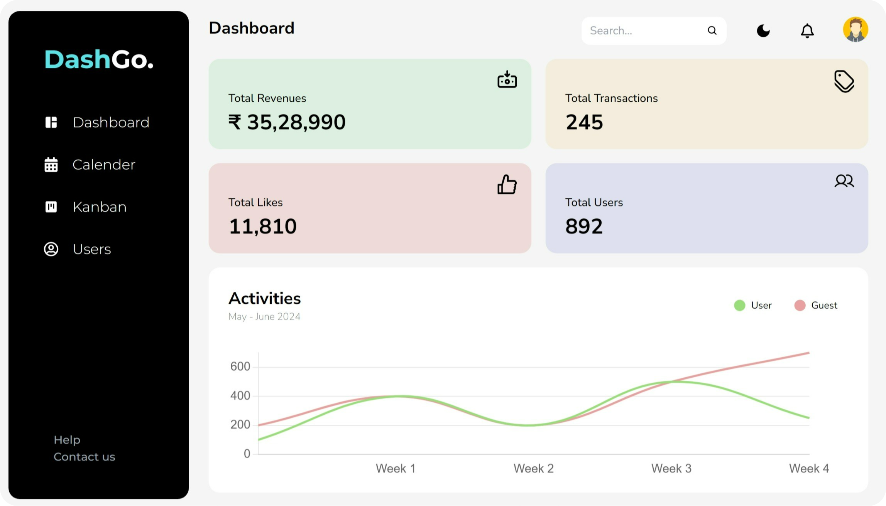
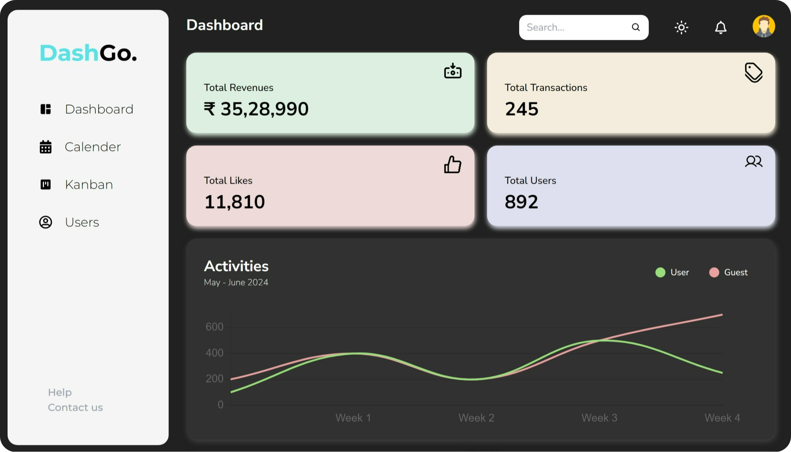
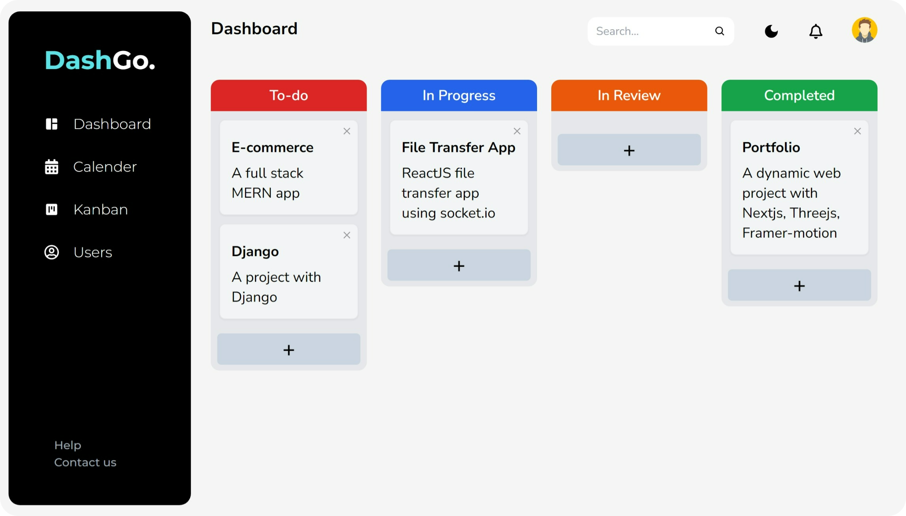

<div align="center">
<h3 align="center">DashGo - Admin DashBoard</h3>
      
      <br>
      
      <br/>
      
  <br />

  <!-- <div>
    
  </div> -->
</div>

## 📋 <a name="table">Table of Contents</a>

1. 🤖 [Introduction](#introduction)
2. ⚙️ [Tech Stack](#tech-stack)
3. 🔋 [Features](#features)
4. 🤸 [Quick Start](#quick-start)
   - [Prerequisites](#prerequisites)
   - [Cloning the Repository](#cloning-the-repository)
   - [Running the Project](#running-the-project)
   - [How to Use It](#how-to-use-it)
5. 🕸️ [Snippets](#snippets)

## <a name="introduction">🤖 Introduction</a>

Welcome to the React Admin Dashboard project! This project is created with Vite and Tailwind CSS, offering a smooth user experience with customizable themes (light mode/dark mode). The dashboard includes tables, charts, a calendar, and a Kanban board. The Users table features sorting (by age and S. No.) and searching (by name). Additionally, the project includes Google Auth sign-in functionality, implemented using Firebase Console, and leverages Context API for state management.

Used `vite` as Vite offers faster build times compared to Create-React-App due to its pre-bundling and efficient hot module replacement

## <a name="tech-stack">⚙️ Tech Stack</a>

- **React**
- **Tailwind CSS**
- **Firebase**
- **Context API**

## <a name="features">🌟 Features</a>

👉 **Customizable Themes**: Users can switch between light mode and dark mode for an optimal viewing experience.

👉 **Tables with Sorting and Searching**: The Users table allows sorting by age and serial number, as well as searching by name.

👉 **Charts**: Various charts to visualize data effectively.

👉 **Calendar**: A fully functional calendar for tracking events.

👉 **Kanban Board**: A Kanban board to manage tasks and projects.

👉 **Google Auth Sign-in**: Secure sign-in functionality using Google Authentication via Firebase.

👉 **Smooth User Experience**: A highly responsive and intuitive interface ensuring smooth user interactions.

## <a name="quick-start">🤸 Quick Start</a>

**Prerequisites**

Follow these steps to set up the project locally on your machine.

Make sure you have the following installed on your machine:

- Git
- Node.js
- npm (Node Package Manager)

**Cloning the Repository**

```bash
https://github.com/gulshanjangid/React-Admin-DashBoard-master.git
cd React-Admin-DashBoard
```

**Running the Project**

Install dependencies

```bash
npm install # or npm i
```

Start the server:

```bash
npm run dev
```

- Open your browser and navigate to `http://localhost:5173`.

**How to Use**

**`Customizable Themes`**

👉 **Switching Themes**: Use the theme toggle button to switch between light mode and dark mode.

**`Users Table`**

👉 **Sorting**: Click on the column headers (Age, S. No.) to sort the table data accordingly.

👉 **Searching**: Enter a name in the search input field to filter the users' list by name

**`Users Table`**

👉 **Viewing Charts**: Navigate to the charts section to view different data visualizations.

**`Calendar`**

👉 **Adding Events**: Click on a date to add a new event.

**`Kanban Board`**

👉 **Managing Tasks**: Drag and drop tasks between different columns to update their status.

**`Google Auth Sign-in`**

👉 **Signing In**: Click on the Google sign-in button to authenticate using your Google account.

## <a name="snippets">🕸️ Snippets</a>

<details>
<summary><code>index.html</code></summary>

```html
<!DOCTYPE html>
<html lang="en">
  <head>
    <meta charset="UTF-8" />
    <link rel="icon" type="image/svg+xml" href="/favicon.ico" />
    <meta name="viewport" content="width=device-width, initial-scale=1.0" />
    <meta name="theme-color" content="#000000" />
    <meta name="description" content="Admin Dashboard created using ReactJS" />
    <title>DashGo</title>
  </head>

  <body className="dark bg-[#F5F5F5] transition-all ease-in delay-300">
    <div id="root"></div>
    <script type="module" src="/src/main.jsx"></script>
  </body>
</html>
```

</details>

<details>
<summary><code>vite.config.js</code></summary>

```javascript
import { defineConfig } from "vite";
import react from "@vitejs/plugin-react";

// https://vitejs.dev/config/
export default defineConfig({
  plugins: [react()],
});
```

</details>

<details>
<summary><code>tailwind.config.js</code></summary>

```javascript
/** @type {import('tailwindcss').Config} */
export default {
  content: ["./index.html", "./src/**/*.{js,ts,jsx,tsx}"],
  darkMode: "class",
  theme: {
    extend: {
      fontFamily: {
        nuito: ["Nunito Sans", "sans-serif"],
      },
    },
  },
  plugins: [],
};
```

</details>

## <a>🚨 Disclaimer</a>

The Admin DashBoard implemented here is intended for educational purposes only.

#
